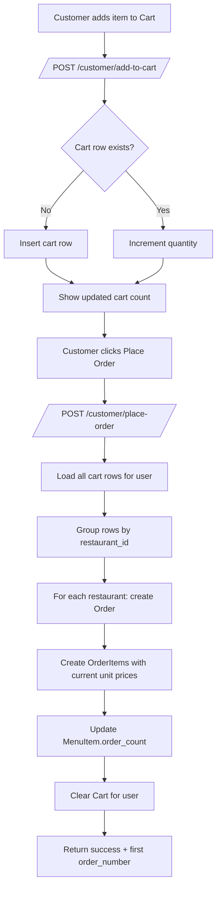
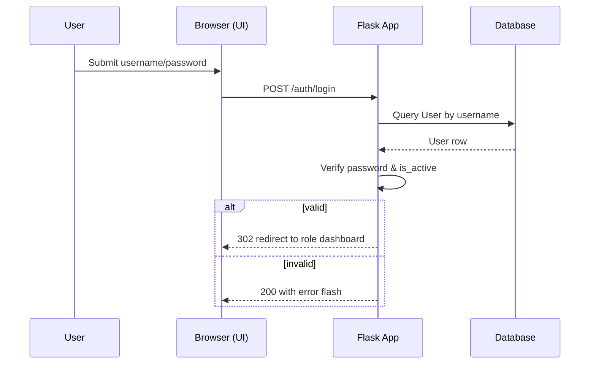

# Mermaid Diagrams

## ER Diagram (Schema)
```mermaid
erDiagram
    USERS ||--o{ RESTAURANTS : owns
    USERS ||--o{ ORDERS : places
    RESTAURANTS ||--o{ ORDERS : receives
    ORDERS ||--o{ ORDER_ITEMS : contains
    RESTAURANTS ||--o{ MENU_ITEMS : offers
    USERS ||--o{ CART : has
    MENU_ITEMS ||--o{ CART : in
    USERS ||--o{ USER_PREFERENCES : sets
    RESTAURANTS ||--o{ REVIEWS : gets
    USERS ||--o{ REVIEWS : writes
    MENU_ITEMS ||--o{ REVIEWS : optional_for

    USERS {
      int id PK
      string username UNIQUE
      string email UNIQUE
      string password_hash
      string role  "customer|restaurant_owner"
      string first_name
      string last_name
      string phone
      text address
      datetime created_at
      bool is_active
    }

    RESTAURANTS {
      int id PK
      int owner_id FK "-> USERS.id"
      string name
      text description
      string cuisine_type
      string location
      string phone
      string email
      float rating
      int total_reviews
      bool is_active
      datetime created_at
    }

    MENU_ITEMS {
      int id PK
      int restaurant_id FK "-> RESTAURANTS.id"
      string name
      text description
      float price
      string category
      string cuisine_type
      bool is_vegetarian
      bool is_vegan
      bool is_gluten_free
      bool is_available
      bool is_special
      bool is_deal_of_day
      int order_count
      string image_url
      datetime created_at
    }

    ORDERS {
      int id PK
      string order_number UNIQUE
      string status "pending|confirmed|preparing|ready|delivered|cancelled"
      float total_amount
      text notes
      datetime created_at
      datetime updated_at
      int customer_id FK "-> USERS.id"
      int restaurant_id FK "-> RESTAURANTS.id"
    }

    ORDER_ITEMS {
      int id PK
      int order_id FK "-> ORDERS.id"
      int menu_item_id FK "-> MENU_ITEMS.id"
      int quantity
      float price "price at time of order"
    }

    CART {
      int id PK
      int customer_id FK "-> USERS.id"
      int menu_item_id FK "-> MENU_ITEMS.id"
      int quantity
      datetime created_at
    }

    USER_PREFERENCES {
      int id PK
      int user_id FK "-> USERS.id"
      string preference_type "favorite_restaurant|favorite_cuisine|dietary_restriction"
      string preference_value
      datetime created_at
    }

    REVIEWS {
      int id PK
      int user_id FK "-> USERS.id"
      int restaurant_id FK "-> RESTAURANTS.id"
      int menu_item_id FK "-> MENU_ITEMS.id (optional)"
      int rating "1..5"
      text comment
      datetime created_at
      text owner_reply
      datetime owner_reply_at
    }
```

## Order Placement Flow


## Login Sequence

